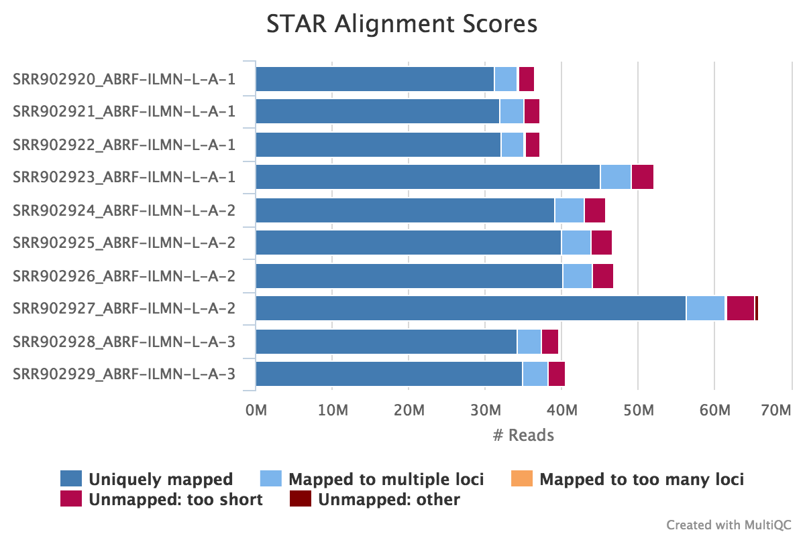
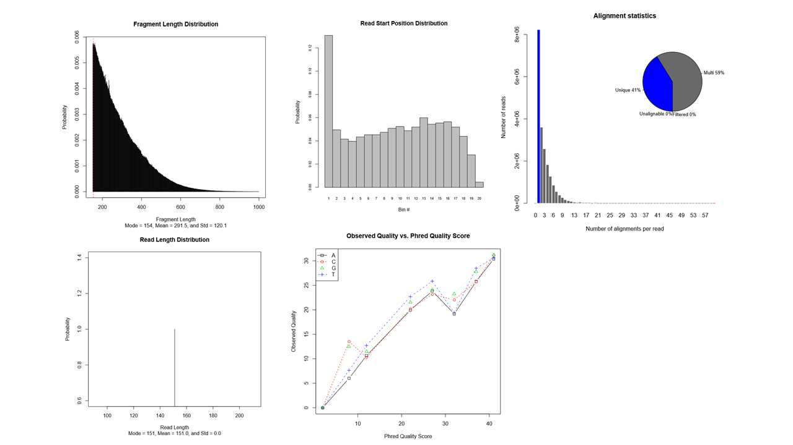
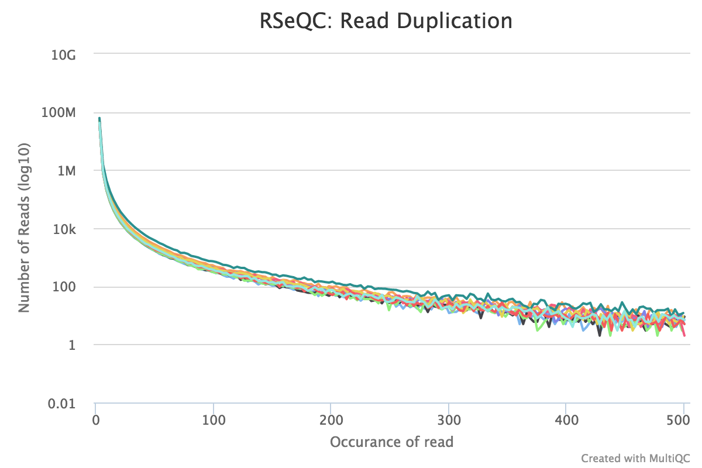
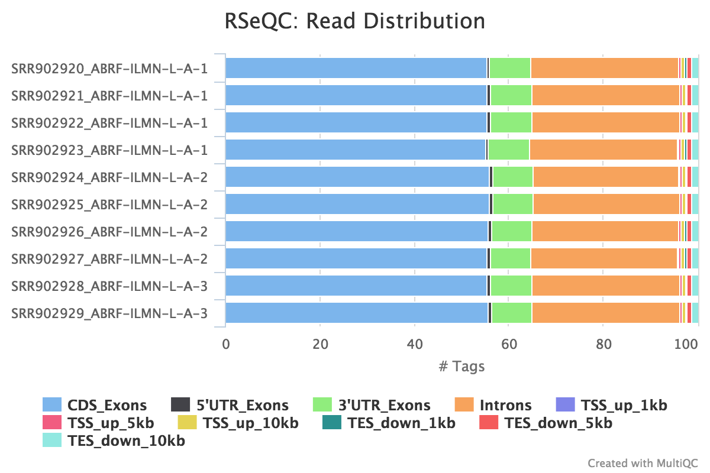

# gis-rpd/rpd-rnaseq Output

## Overview


This pipelines processes data using the following steps:

* [FastQC](#fastqc) - read quality control
* [TrimGalore](#trimgalore) - adapter trimming
* [STAR](#star) - alignment
* [RSEM](#rsem-calculate-expression) - Estimate gene and isoform expression from RNA-Seq data
* [Picard CollectRnaSeqMetrics](#picard-collectrnaseqmetrics)- RNA alignment metrics for a BAM file
* [RSeQC](#rseqc) - RNA quality control metrics
   - [BAM stat](#bam-stat)
   - [Read duplication](#read-duplication)
   - [Read distribution](#read-distribution)
* [deepTools](#bamCoverage) - visualization
* [MultiQC](#multiqc) - aggregate report, describing results of the whole pipeline


All results are written to the specified publish directory, which is `results` by default (which is
assumed below).

Many results (FastQC, STAR alignment stats, RSeQC results) are summarised in MultiQC plots, which
can be found in `results/MultiQC/multiqc_report.html`. An [example MulltiQC report can be download
here](multiqc_report.example.html.zip)

All pipeline internal info (timings etc.) are written to `results/pipeline_info/`. Most of this will not be
of interest to the average user.

Results per sample can be found in the respectively named folders. If one of your samples is called
`ABC`, then you will find a folder called `results/ABC`, with all the following subfolders.

The MultiQC plots are a good starting point to explore your results.


## MultiQC
[MultiQC](http://multiqc.info) is a visualisation tool that generates a single HTML report summarising all samples in your project. Most of the pipeline QC results are visualised in the report and further statistics are available in within the report data directory.

**Output directory: `results/multiqc`**

* `Project_multiqc_report.html`
  * MultiQC report - a standalone HTML file that can be viewed in your web browser
* `Project_multiqc_data/`
  * Directory containing parsed statistics from the different tools used in the pipeline

For more information about how to use MultiQC reports, see http://multiqc.info


## FastQC
[FastQC](http://www.bioinformatics.babraham.ac.uk/projects/fastqc/) gives general quality metrics about your reads. It provides information about the quality score distribution across your reads, the per base sequence content (%T/A/G/C). You get information about adapter contamination and other overrepresented sequences.

For further reading and documentation see the [FastQC help](http://www.bioinformatics.babraham.ac.uk/projects/fastqc/Help/).

> **NB:** The FastQC plots displayed in the MultiQC report shows _untrimmed_ reads. They may contain adapter sequence and potentially regions with low quality. To see how your reads look after trimming, look at the FastQC reports in the `trim_galore` directory.

**Output directory: `results/fastqc`**

* `sample_fastqc.html`
  * FastQC report, containing quality metrics for your untrimmed raw fastq files
* `zips/sample_fastqc.zip`
  * zip file containing the FastQC report, tab-delimited data file and plot images

## TrimGalore
The nfcore/rnaseq pipeline uses [TrimGalore](http://www.bioinformatics.babraham.ac.uk/projects/trim_galore/) for removal of adapter contamination and trimming of low quality regions. TrimGalore uses [Cutadapt](https://github.com/marcelm/cutadapt) for adapter trimming and runs FastQC after it finishes.

MultiQC reports the percentage of bases removed by TrimGalore in the _General Statistics_ table, along with a line plot showing where reads were trimmed.

**Output directory: `results/trim_galore`**

Contains FastQ files with quality and adapter trimmed reads for each sample, along with a log file describing the trimming.

* `sample_val_1.fq.gz`, `sample_val_2.fq.gz`
  * Trimmed FastQ data, reads 1 and 2.
  * NB: Only saved if `--saveTrimmed` has been specified.
* `logs/sample_val_1.fq.gz_trimming_report.txt`
  * Trimming report (describes which parameters that were used)
* `FastQC/sample_val_1_fastqc.zip`
  * FastQC report for trimmed reads


Single-end data will have slightly different file names and only one FastQ file per sample.

* `sample_trimmed.fq.gz`
  * Trimmed FastQ data, read 1.
* `FastQC/sample_trimmed_fastqc.zip`
  * FastQC report for trimmed reads

## STAR
STAR is a read aligner designed for RNA sequencing.  STAR stands for Spliced Transcripts Alignment to a Reference, it produces results comparable to TopHat (the aligned previously used by NGI for RNA alignments) but is much faster.

The STAR section of the MultiQC report shows a bar plot with alignment rates: good samples should have most reads as _Uniquely mapped_ and few _Unmapped_ reads.



**Output directory: `results/STAR`**

* `Sample_Aligned.sortedByCoord.out.bam`
  * The aligned BAM file
* `Sample_Log.final.out`
  * The STAR alignment report, contains mapping results summary
* `Sample_Log.out` and `Sample_Log.progress.out`
  * STAR log files, containing a lot of detailed information about the run. Typically only useful for debugging purposes.
* `Sample_SJ.out.tab`
  * Filtered splice junctions detected in the mapping


## RSEM
RSEM is a software package for estimating gene and isoform expression levels from RNA-Seq data by rsem-calculate-expression and rsem-plot-model for visulazing the model learned.
The plot include fragment length distribution, mate length distribution, read start position distribution (RSPD), quality score vs observed quality given a reference base, position vs percentage of sequencing error given a reference base and alignment statistics.



RSEM documentation: [rsem-calculate-expression](https://deweylab.github.io/RSEM/rsem-calculate-expression.html) [rsem-plot-model] (https://github.com/deweylab/RSEM)

**Output directory: `results/rsem`**

* `Sample.genes.results`
  * genes expression count matrix
* `Sample.isoforms.results`
  * isoforms expression count matrix
* `Sample..pdf`
  * rsem-plot-model


## Picard CollectRnaSeqMetrics
Produces RNA alignment metrics for a SAM or BAM file.

This tool takes a SAM/BAM file containing the aligned reads from an RNAseq experiment and produces metrics describing the distribution of the bases within the transcripts. It calculates the total numbers and the fractions of nucleotides within specific genomic regions including untranslated regions (UTRs), introns, intergenic sequences (between discrete genes), and peptide-coding sequences (exons). This tool also determines the numbers of bases that pass quality filters that are specific to Illumina data (PF_BASES). For more information please see the corresponding GATK Dictionary entry.

Other metrics include the median coverage (depth), the ratios of 5 prime /3 prime-biases, and the numbers of reads with the correct/incorrect strand designation. The 5 prime /3 prime-bias results from errors introduced by reverse transcriptase enzymes during library construction, ultimately leading to the over-representation of either the 5 prime or 3 prime ends of transcripts.


**Output directory: `results/RnaSeqMetrics`**

* `Sample_RNA_Metrics.txt `
  * RNA alignment metrics

Picard documentation: [CollectRnaSeqMetrics](https://broadinstitute.github.io/picard/command-line-overview.html#CollectRnaSeqMetrics)

## RSeQC
RSeQC is a package of scripts designed to evaluate the quality of RNA seq data. You can find out more about the package at the [RSeQC website](http://rseqc.sourceforge.net/).

This pipeline runs several, but not all RSeQC scripts. All of these results are summarised within the MultiQC report and described below.

**Output directory: `results/rseqc`**

These are all quality metrics files and contains the raw data used for the plots in the MultiQC report. In general, the `.r` files are R scripts for generating the figures, the `.txt` are summary files, the `.xls` are data tables and the `.pdf` files are summary figures.

### BAM stat
**Output: `Sample_bam_stat.txt`**

This script gives numerous statistics about the aligned BAM files produced by STAR. A typical output looks as follows:

```
#Output (all numbers are read count)
#==================================================
Total records:                                 41465027
QC failed:                                     0
Optical/PCR duplicate:                         0
Non Primary Hits                               8720455
Unmapped reads:                                0

mapq < mapq_cut (non-unique):                  3127757
mapq >= mapq_cut (unique):                     29616815
Read-1:                                        14841738
Read-2:                                        14775077
Reads map to '+':                              14805391
Reads map to '-':                              14811424
Non-splice reads:                              25455360
Splice reads:                                  4161455
Reads mapped in proper pairs:                  21856264
Proper-paired reads map to different chrom:    7648
```

MultiQC plots each of these statistics in a dot plot. Each sample in the project is a dot - hover to see the sample highlighted across all fields.

RSeQC documentation: [bam_stat.py](http://rseqc.sourceforge.net/#bam-stat-py)


### Read duplication
**Output:**

* `Sample_read_duplication.DupRate_plot.pdf`
* `Sample_read_duplication.DupRate_plot.r`
* `Sample_read_duplication.pos.DupRate.xls`
* `Sample_read_duplication.seq.DupRate.xls`

This plot shows the number of reads (y-axis) with a given number of exact duplicates (x-axis). Most reads in an RNA-seq library should have a low number of exact duplicates. Samples which have many reads with many duplicates (a large area under the curve) may be suffering excessive technical duplication.



RSeQC documentation: [read_duplication.py](http://rseqc.sourceforge.net/#read-duplication-py)


### Read distribution
**Output: `Sample_read_distribution.txt`**

This tool calculates how mapped reads are distributed over genomic features. A good result for a standard RNA seq experiments is generally to have as many exonic reads as possible (`CDS_Exons`). A large amount of intronic reads could be indicative of DNA contamination in your sample or some other problem.



RSeQC documentation: [read_distribution.py](http://rseqc.sourceforge.net/#read-distribution-py)


## deepTools

###bamCoverage
This tool takes an alignment of reads from star as input (BAM file) and generates a coverage track (bigWig) as output. Genomic-coordinate files can be visualized by both UCSC Genome browser and Broad Institute's Integrative Genomics Viewer (IGV). Transcript-coordinate files can be visualized by IGV.

It generate two independent bigWig files for all reads on the forward and reverse strand, respectively.

**Output:**

* `Sample_fwd.bw`
* `Sample_rev.bw`

deepTools documentation: [bamCoverage](https://deeptools.readthedocs.io/en/develop/content/tools/bamCoverage.html)


